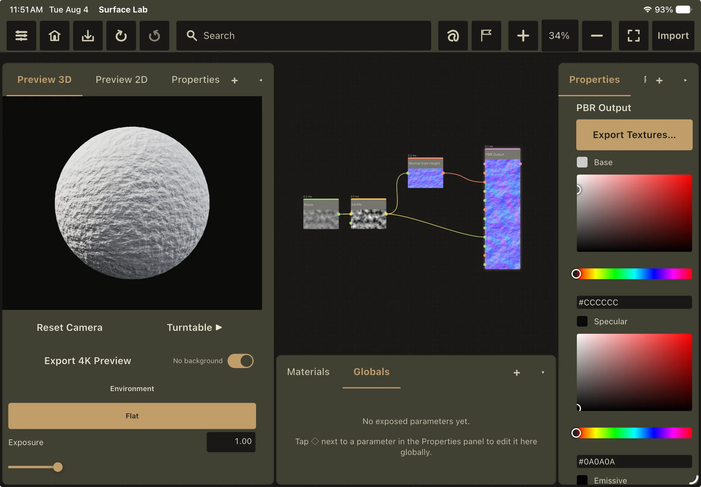

This is the fetched body. It lives at `comms/<id>.<hash>.md` and is downloaded
only when this card is opened, which is why the inline paragraph above and this
one are different things.

## What this card is checking

- The card renders with a **pinned** badge, above everything in its own group.
- The date header reads "August 6, 2026" no matter what timezone the device is
  in, because the string comes from the server.
- No version appears on the card anywhere. Every item in this feed reaches
  every version of the app, whichever build you are running.
- All three actions render, in order, with the first one styled as primary.
- This body was fetched on open rather than shipped with the feed.

## Markdown

Headings, paragraphs, `inline code`, **bold**, *italic* and links such as
[the release notes](/blog/whats-new-in-1-2-2) all render. That link was written
site-relative and rewritten to an absolute URL by the build, because the app
has no origin to resolve it against.

1. Ordered lists
2. work as well
3. as bullets

> Blockquotes render as blockquotes.

```glsl
// Fenced code passes through untouched.
vec3 shade(vec3 albedo, float roughness) {
    return albedo * (1.0 - roughness);
}
```

## Images

The image below was authored as a source asset and rewritten by the build into
a feed-relative WebP derivative capped at 1600px. If it renders, image handling
is correct end to end; if you get a grey box, the rewrite is broken.



| Tables | also |
|---|---|
| render | fine |

The three other smoke-test entries in this build are checking things you should
*not* be able to see: one is scheduled for the future, one has expired, and one
is restricted to desktop platforms.
