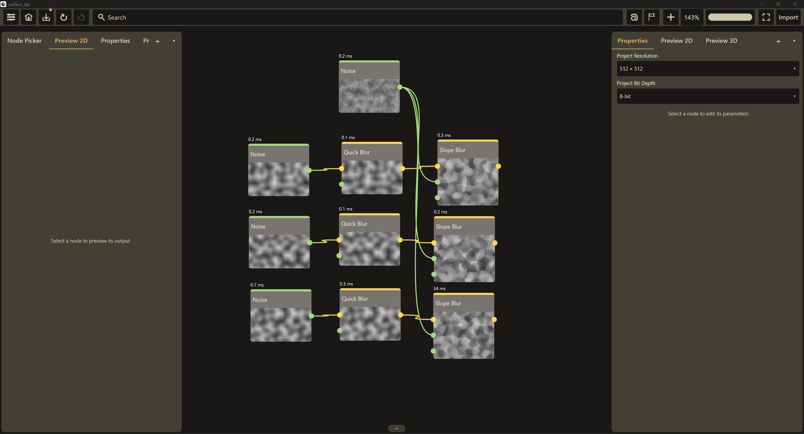
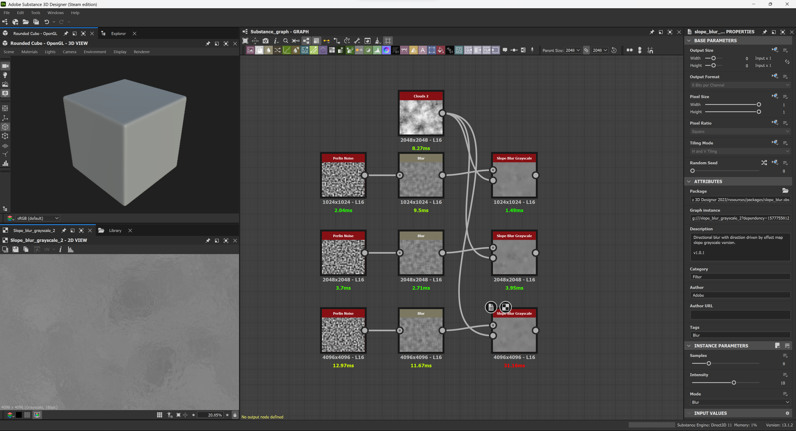
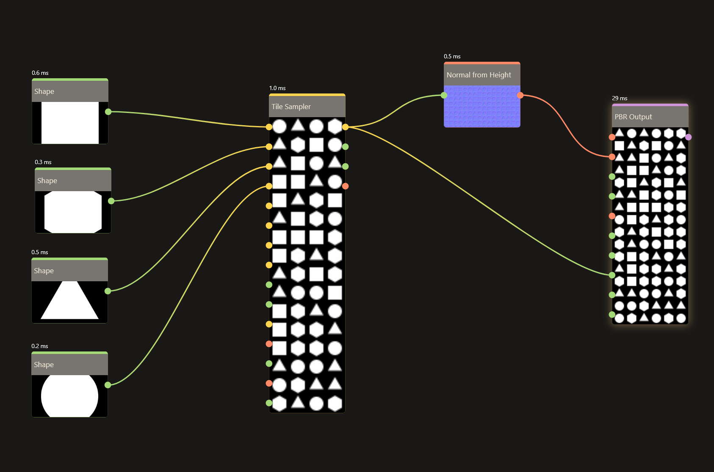
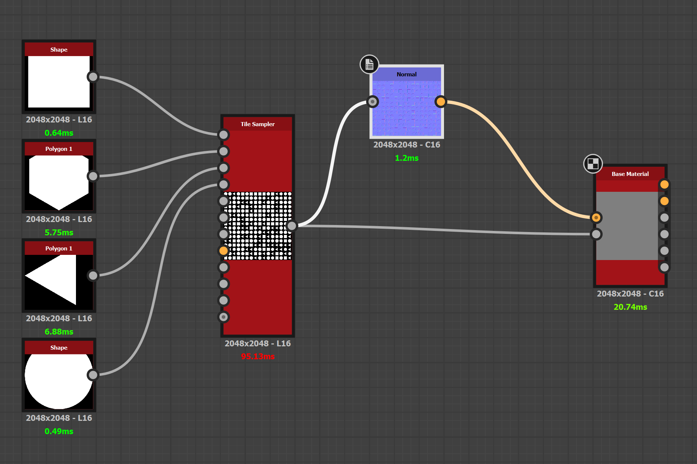

Surface Labs, as of ver 1.2.0, ships with a Rust Engine to compute and render all 
shader nodes and the 3D viewport. I've known for a while that it's fast - but a 
side by side comparison has been on my todo list since the engine - not Dart -
rendered its first 2D node. I have to say, I'm quite pleased with the results and
overall they've shown me some places that the app can still find improvements. 

## The setup

All tests ran on my personal laptop and were recorded via OBS at 1080p 60fps.
To make them more optimal for the website, they were converted to .webm formats at
a lower FPS. 

- **Hardware:** i7-11800H · laptop RTX 3070 · 64 GB DDR4 · Windows 11
- **Substance 3D Designer 13.1.2** (2023, Steam edition), Direct3D 11 engine
- **Surface Labs 1.2**, Direct3D 12 (native Rust engine)
- Matched per stage: same resolutions, same **16-bit** depth, same node
  parameters on both sides (one exception, noted in
  [the fine print](#the-fine-print))
- Timings are each app's own per-node profiler readout, warm (first-run shader
  compiles excluded; covered in [Cold starts](#cold-starts))

Being up front - the screenshots are unfair to both applications. 

It's easy to sit down and photoshop some images together and be like "Look how
amazing I am!" Some applications show cold start times and others just happen
to have an unlucky render. This is why videos were made to show multiple random
generations using as accurate graphs as possible between the two. 

### Substance Designer 2023 (ver 13.1.2)

The whole reason I programmed this application is because of the absurdity of
subscriptions and rising costs of tools by the monoliths in the game development
community. 13.1.2 just happens to be the version I have a license to via steam, and
I have no intent on purchasing a new license just to compare. I would love to see other
users compare and contrast the software with their own findings, and I'd be happy to append
or create a new blog post with community findings (community reviewed as well) with
latest versions. 

## Test 1: the blur stack

Three parallel chains of **Noise → Blur → Slope Blur** at 1024², 2048², and
4096², all 16-bit, with a Clouds node driving each Slope Blur's effect input.
Both Slope Blur nodes ran in their default state as created: 8 samples at
intensity 10 in Designer, 32 samples at intensity 0.10 in Surface Labs. The two
implementations are not 1:1 internally, so read that row as default vs default,
not as a like-for-like kernel comparison.

<figure>
  <video controls muted loop playsinline preload="metadata" style="width:100%"><source src="/video/sl_blur.mp4" type="video/mp4" /><source src="/video/sl_blur.webm" type="video/webm" /></video>
  <figcaption>Surface Labs: stepping through each node's resolution and bit depth, then cycling seeds. Timings hold steady across rolls.</figcaption>
</figure>

<figure>
  <video controls muted loop playsinline preload="metadata" style="width:100%"><source src="/video/sd_blur.mp4" type="video/mp4" /><source src="/video/sd_blur.webm" type="video/webm" /></video>
  <figcaption>Designer: same graph, cycling seeds. Timings swing noticeably between rolls; the ranges below cover what the camera saw.</figcaption>
</figure>

All numbers in milliseconds, lower is better. Ranges span the seed rolls in the
videos plus the still captures.

| Node | Resolution | Substance 13.1.2 | Surface Labs 1.2 | Typical |
|---|---|---|---|---|
| Noise (Perlin) | 1024² | 1.46 – 2.71 | 0.2 – 0.3 | ~8× faster |
| Blur | 1024² | 0.33 – 1.87\* | 0.1 | ~11× faster |
| Slope Blur | 1024² | 1.04 – 1.49 | 0.3 – 0.4 | ~3× faster |
| Noise (Perlin) | 2048² | 3.70 – 4.42 | 0.2 | ~20× faster |
| Blur | 2048² | 1.01 – 2.71 | 0.1 | ~20× faster |
| Slope Blur | 2048² | 2.07 – 3.95 | 0.2 – 0.3 | ~10× faster |
| Noise (Perlin) | 4096² | 12.97 – 25.96 | 0.3 – 0.7 | ~40× faster |
| Blur | 4096² | 4.89 – 11.67 | 0.2 – 0.3 | ~22× faster |
| Slope Blur | 4096² | 21.58 – 31.16 | 34.0 | **Substance wins by ~10–35%** |

:::note
\* One 9.50 ms sample of Designer's 1024² Blur was excluded as a first-run
shader compile, not steady state.
:::

In these samples, I think the results speak for themselves. I'm no stranger to 
archaic code, project maintenance, and the other onslaught of issues being a 
legacy software brings. Across the board it's apparent that Surface Labs performs
better at nearly every stage. 

I'm not privy to the codebase of Substance, but I have my suspicions that they maintain
an aggressive stance on caching and recalculating shaders depending on various criteria. 
The Rust Engine is fast, and DX12 is a modern graphics API compared to DX11 and 
whatever else Substance has going on under the hood. 

:::note
<small>I'm also considering an optional Vulkan/DX12 choice for Windows users in a future update.</small>
:::

I actually really enjoy that I took a loss on the slope blur. Compute shaders - which we'll
discuss more in the next section is still fairly new to me as a programmer. My slope blur
is a compute shader, and actually drives the same backend as my erosion node as well. At 4k
resolution taking a loss is actually a win, and I'm looking forward to reviewing this shader
and bringing a stronger engine to the field in future updates. 

## Test 2: the Tile Sampler

Four shape generators feeding a **16×16 Tile Sampler**, into a normal map, into
the material output. Everything at 2048², 16-bit, on both sides.

<figure>
  <video controls muted loop playsinline preload="metadata" style="width:100%"><source src="/video/sl_sampler.mp4" type="video/mp4" /><source src="/video/sl_sampler.webm" type="video/webm" /></video>
  <figcaption>Surface Labs: node settings, then seed cycling. The Tile Sampler sits at ~1 ms per roll.</figcaption>
</figure>

<figure>
  <video controls muted loop playsinline preload="metadata" style="width:100%"><source src="/video/sd_sampler.mp4" type="video/mp4" /><source src="/video/sd_sampler.webm" type="video/webm" /></video>
  <figcaption>Designer: same 16×16 sampler, cycling seeds, 66 to 95 ms per roll.</figcaption>
</figure>

| Node | Substance 13.1.2 | Surface Labs 1.2 | Typical |
|---|---|---|---|
| Shape (square) | 0.64 | 0.6 | ~1× (tie) |
| Polygon (pentagon) | 5.75 | 0.3 | ~19× faster |
| Polygon (triangle) | 2.46 – 6.88 | 0.5 | ~9–14× faster |
| Shape (circle) | 0.49 – 3.34 | 0.2 – 0.8 | ~2–4× faster |
| **Tile Sampler (16×16)** | **65.87 – 95.13** | **1.0** | **~66–95× faster** |
| Normal | 0.18 – 1.2 | 0.1 – 0.5 | ~2× faster |
| Output node | 20.74 – 27.94 | 29 | Substance slightly faster |

<small> † The output nodes are different nodes doing different work, Designer's Base
Material vs Surface Labs' PBR Output, included for completeness rather than
comparison - and the PBR Output node still needs a second pass since the 2D side
of the rust engine has been implemented. </small>

Ooooookayyy... so lets not get ahead of ourselves here. 66-95x faster is a CRAZY thing to claim. Well I am.
beat it. Actually not impossible, it's just a different generation and technical spec
for the two systems. All Substance Designer nodes can be "opened" and viewed freely, and so we know 
that Substance relies heavily on the FXMap - or a sequential algorithm for splattering. 
They're also computing several more layers of data than I am and so in theory their
node is more robust. 

Surface Labs differs because it's built on compute shaders. It resolves each pixel in 
parallel at once, then maps the basic amount of data available to use elsewhere in the graph. 
It's not a marvel of engineering, it's simply newer and built on modern tech.

## Cold starts

Both apps pay a first-evaluation cost, and it's only fair to show both:

- Surface Labs' Tile Sampler opened at **161 ms** on its first evaluation and
  settled to **1.0 ms** every roll after. The PBR Output went 65 → 29 ms.
- Designer's 1024² Blur first ran at **9.50 ms** before settling to well under
  2 ms. Its Tile Sampler, however, never dropped below **~66 ms** warm.

## The fine print

- This is **not** an exhaustive benchmark: two graphs, a handful of nodes, one
  machine.
- Designer 13.1.2 is the newest version I own. Newer releases may well be
  faster - if you run these graphs on 14.x+, I'd like to see the
  numbers.
- All timings come from each app's built-in per-node profiler, read off the
  node UI, warm, across repeated seed randomization. The videos are the raw
  evidence being used here, with pngs for slower internet connections.
- Node parameters were matched wherever the two apps expose the same control
  (resolutions, bit depth, 16×16 sampling). The Slope Blurs are the one
  exception: each ran at its own defaults (8 samples / intensity 10 in
  Designer, 32 samples / intensity 0.10 in Surface Labs) and the two
  implementations are not 1:1 internally. The outputs are shown so you can
  judge equivalence yourself.

## Conclusion

Needless to say, I really find my work in Surface Labs to be worthwhile. These timings - 
as scuffed as my testing may be - prove that I'm onto something that's a contender. Infantile
but promising. Also - who else has texturing on iPads? Just sayin. Thanks for reading my silly
blog post, and look forward to version 1.2.1 where I render the world faster than 3ms.

<small> just kidding, but I did redo the toolbar and I've also started making real documentation.</small>
