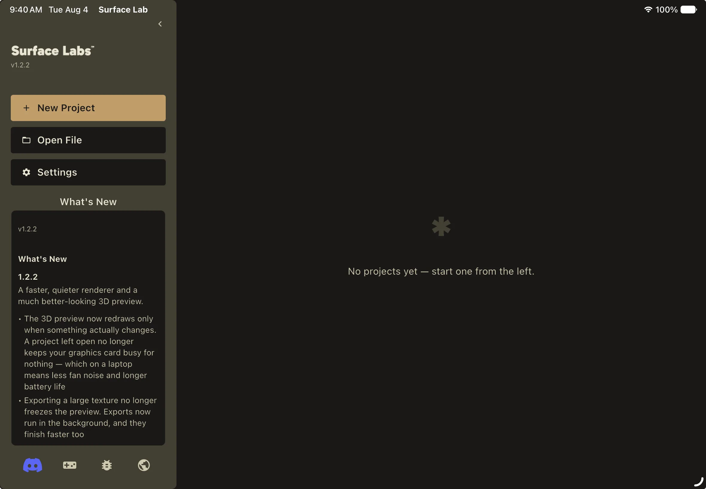
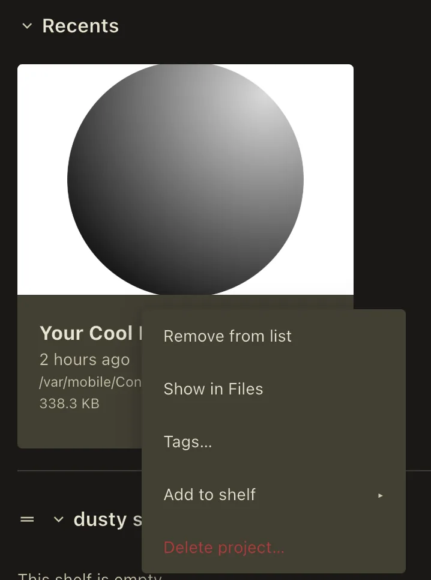
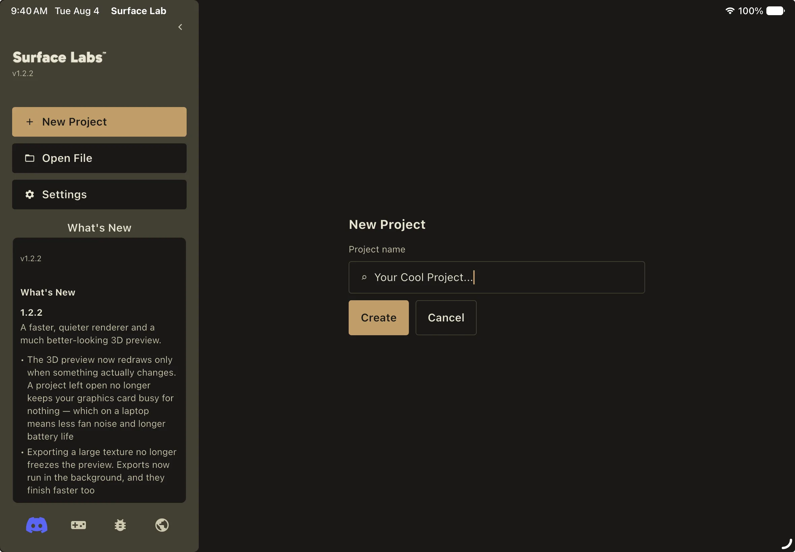

The Project Hub is the first interactive screen after the splash. Opening a
project replaces the hub with the editor; **Back to Hub** in the editor replaces
it back.

The hub is made of two panels: a navigation panel with the app-level actions,
and the projects area, organized into shelves. Like the editor's panels, where
these render on screen is your choice, so this page describes what each panel
contains rather than where it sits.

## The navigation panel

A chevron at the top of the panel collapses it to an icon-only mini state; the
same chevron expands it again. It contains:

- The Surface Labs mark and the running version number.
- **New Project**, which opens the inline creation form in the projects area.
- **Open File**, a native open dialog filtered to `.surfacelabs`.
- **Settings**, which opens the Settings window.
- **What's New**, an inset card showing the bundled changelog for the current
  version, rendered as headings, paragraphs and bullet lists. It is read from a
  file inside the app; nothing is fetched from the network.
- Social links: Discord, the itch.io store page, and the public GitHub
  repository. A website link also exists but currently points at a placeholder
  address that is not a real site.

## Shelves

The projects area is organized into **shelves**: named, collapsible groupings of
project cards.

- **Recents** is built in and always first, laid out as a horizontal carousel,
  most-recently-modified first. Membership is computed, not editable.
- **Favorites** is a normal, fully editable shelf that ships pre-created.
- **Library** is built in and always last, laid out as a grid, alphabetical,
  containing every project the app knows about. Membership is computed.
- Any shelves you create sit between Recents and Library, and can be reordered
  by dragging.

Each shelf has a collapse toggle and a carousel/grid display toggle. A shelf
toolbar sits above them all: **+ New Shelf**, **Collapse All** / **Expand All**
(the label flips depending on the current state), and a **search** field.
Deleting a shelf asks *Delete shelf?* first; the projects stay in your library,
only the grouping is removed.

Search uses fuzzy subsequence matching on the project name, so `prj` finds
"Procedural Rocks Jagged". A **tag filter strip** sits alongside it. Selected
tags are combined with AND (picking `stone` then `wip` narrows to projects
carrying both), and the tag filter and the search text also combine with AND.

:::caution[missing screenshot]
The shelf toolbar with the search field and tag filter strip, filtering a
library of projects.
:::

## Project cards

Each card is roughly 280 by 320 points: a thumbnail on top and a metadata strip
below with the project name, a relative last-modified time ("2 hours ago"), a
truncated path and the file size. The thumbnail comes from the project's cached
output-node render, cropped to fill; if no render is cached it silently falls
back to the app icon. Thumbnail failures never show an error.

Tap or click a card to open it. Right-click (desktop) or long-press (touch)
opens a context menu:

- **Remove from list** forgets the project without touching the file.
- **Show in Explorer** / **Show in Files** reveals the archive in the system
  file browser.
- **Delete project…** permanently deletes the `.surfacelabs` file, gated behind
  a *Delete project?* confirmation that states the action cannot be undone.
- **Add to shelf** is a fly-out listing every user shelf the project is not
  already on.
- **Remove from shelf** appears only when the card is being shown inside a user
  shelf, and asks for confirmation.
- A tag picker for the project's tags.

If the file behind a card is not where the hub last saw it, opening it repairs
the path first. This is what keeps projects from disappearing on iPad, where the
system relocates the app's Documents container: the stored pointer goes stale,
but the file is still there under the new container and the repaired path finds
it. The same repair runs over the whole list and over every shelf when the hub
loads.

When repair cannot find it either, the card is flagged as missing but **stays in
your library** rather than being forgotten, and a toast explains why: *Project
not found — it may have been moved, deleted, or be on a drive that isn't
connected. It stays in your library.* A card that can't open today because an
external drive is unplugged is not a card worth throwing away.

## Creating a project

**New Project** replaces the shelves with an inline form, not a dialog:

1. **Project name** is a single text field. Leaving it blank shows *Enter a
   project name.* and keeps **Create** disabled.
2. **Create** reads *Creating…* while it works. The name is slugified into a
   filename, a collision-free path is resolved under `Documents/Surface Labs/`,
   an empty project archive is written, the project is added to Recents, and
   the editor opens.
3. **Cancel** returns to the shelves.

If the write fails you get *Could not create the project. Please try again.*

## The recovery shelf

If the app finds an `.autosave` companion left over from an unclean shutdown, an
amber-accented strip slides in above the shelves. **Restore** applies the
autosave to the project and opens it. **Discard** deletes the autosave and
dismisses the shelf permanently. **Collapse** hides it for this session only; it
reappears on the next cold launch, so nothing is lost by dismissing it
accidentally.

How autosaves are written and applied is covered in
[Autosave and Recovery](/docs/help/autosave-and-recovery/).

:::caution[missing screenshot]
The amber recovery shelf above the project shelves, with the Restore, Discard
and Collapse actions.
:::

## The crash-report notice

Separately from the recovery shelf, if the app finds crash artifacts it has not
already told you about, it posts a **toast** rather than a dialog. Coming back
from a crash is the moment you want your project, not a modal in the way.

The toast says which run crashed:

> The previous session ended unexpectedly. Export a diagnostics report to help
> get it fixed?

or, when the artifacts are older than the run you just came from:

> An earlier session ended unexpectedly. Export a diagnostics report to help get
> it fixed?

**Export…** on the toast asks for a destination folder, writes one ZIP of the
crash dumps and logs, then reveals it and reports where it landed. With nothing
to bundle it says *No crash report to export.*

The toast lingers longer than an ordinary one, then slides away on its own.
Letting it go is the answer: **that crash is never offered again**, on this
launch or any future one. Crash artifacts more than a week old are never
surfaced at all, since diagnostics that stale rarely match the build you are
running.

Settings → General → **Export Diagnostics…** writes a diagnostics zip at any
time, whether or not a crash was detected. It carries the crash dumps and
session logs plus any projects that failed to load and the project you have
open.
