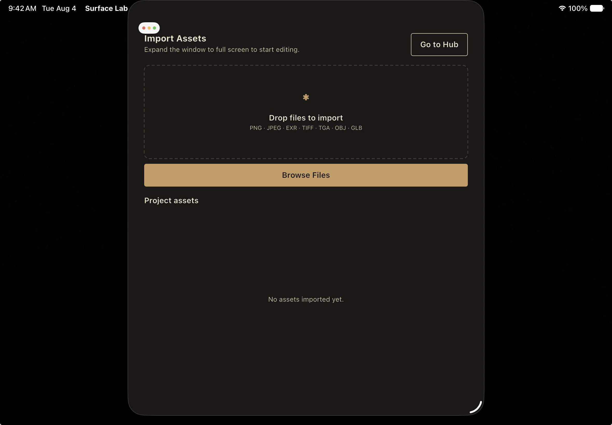

import { Tabs, TabItem } from '@astrojs/starlight/components';

Surface Labs is a desktop, tablet and phone application.

## Download

Every build except the iPad one ships from the
[Surface Labs itch.io page](https://arcticraven.itch.io/surface-labs).

<Tabs syncKey="platform">
<TabItem label="Windows">

Download `surface_lab-<version>-windows-x64.zip` and unzip it anywhere. There is
no installer, and nothing is written to the registry.

Run `surface_lab.exe` from the unzipped folder. Keep that folder intact: the
executable needs `flutter_windows.dll`, the plugin DLLs and the `data/`
directory sitting beside it. The Visual C++ runtime is bundled, so you should
not need to install one separately. Nothing here needs administrator rights.

Rendering goes through DirectX 12. If the 3D preview misbehaves on a particular
machine, Settings → General → **Graphics Backend** switches the render core to
Vulkan; it takes effect after a restart, and a machine with no Vulkan adapter
falls back to DirectX 12 on its own. It is an escape hatch for a driver bug, not
a faster path.

To uninstall, delete the folder.

</TabItem>
<TabItem label="macOS">

Download `surface_lab-<version>-macos-universal.zip`, unzip it, and drag
`surface_lab.app` into Applications.

The build is Developer ID signed and notarized, so Gatekeeper accepts it on
first launch. You do not need the right-click-then-Open workaround.

The binary is universal and runs natively on both Apple Silicon and Intel.

</TabItem>
<TabItem label="Linux">

Two packages are published. Install whichever matches your distribution:

- Debian and Ubuntu: the `.deb`
- Arch: the `.pkg.tar.zst`

Rendering goes through Vulkan on Linux, so you need a working Vulkan driver.
Under WSLg this resolves to a software implementation, which runs but is slow.

</TabItem>
<TabItem label="Android">

Download the APK matching your device architecture, arm64 or x64, and install it
the same way you would any other APK.

</TabItem>
<TabItem label="iPad">

iPad builds go out through TestFlight rather than the App Store, and the beta is
open to anyone.

Install TestFlight from the App Store, then join at
[testflight.apple.com/join/19Q9WBRD](https://testflight.apple.com/join/19Q9WBRD).
Builds expire on TestFlight's usual 90-day cycle, so you will be prompted to
update periodically.

</TabItem>
</Tabs>

## Minimum requirements

| Platform | Requirement |
| --- | --- |
| Windows | A GPU capable of Direct3D 12 |
| macOS | 10.15 Catalina or later, Apple Silicon or Intel |
| Linux | A working Vulkan driver |
| iPadOS | 13.0 or later, iPad only |

Surface Labs is not offered on iPhone.

:::note[iPad hardware]
iPadOS 13 is the declared target, but the Metal renderer, the 3D preview and the
memory budgets have only been exercised on Apple-silicon hardware. Older
A-series iPads are untested. Treat an M-series iPad as the practical
requirement.
:::

## Hardware notes

There is no formal minimum-spec sheet. What has actually been measured:

- 8192 x 8192 textures on an M3 iPad Air, before handhelds were capped at 4096
- On Windows with an RTX 3070, the Erosion node takes roughly 230 ms for 80
  steps at 2048 x 2048

Any modern discrete or recent integrated GPU handles work at 1024 x 1024 through
2048 x 2048 comfortably. Projects at 4096 x 4096 are memory-hungry; see
Resolution & Bit Depth for how the memory governor allocates.

## Resolution ceiling

The authoring ladder is 256, 512, 1024, 2048, 4096 and 8192, and it is the same
list for the project resolution and for a per-node override. 8192 is the top of
what the graphics API guarantees on every desktop adapter the app runs on.

**iOS and Android stop at 4096.** Evaluating an 8K graph runs a tablet or phone
out of memory, so the dropdowns do not offer it there, and a project authored at
8192 on desktop is brought down to 4096 as it opens, before the engine ever
holds the graph. Switching to a material that was authored higher clamps it too,
with a toast: *This material was authored above 4096 × 4096 and has been reduced
to fit this device.* A value above the cap that is already set on a node stays
visible in the dropdown, so the field never misreports what the node is on.

## What differs on iPad

Most of the application is identical everywhere. The exceptions are all on iPad:

| Feature | Desktop | iPad |
| --- | --- | --- |
| Node canvas, properties, export | Yes | Yes |
| Maximum resolution | 8192 | 4096 |
| Minimap / Node Map panel | Yes | Not drawn |
| In-app MCP server | Yes | Not available |
| Open in File Manager | Yes | Not available |
| Command palette | Yes | Needs a hardware keyboard or a game controller |
| Game controller input | Yes | Yes |

Android shares the 4096 ceiling with iPad. The minimap is only withheld on
iPadOS; it is drawn on Android.

:::caution[iPad requires full screen]
If the window is more than about 10 points smaller than the screen in either
dimension, which happens in Split View, Slide Over, or when resizing under Stage
Manager, the editor refuses to run. You get the asset-import screen and a toast
reading *Expand to full screen to start editing*. Return the app to full screen
and the editor comes back.
:::



## Where your projects live

New projects are created in a **Surface Labs** folder inside your Documents
folder, made the first time it is needed.

| Platform | Default location |
| --- | --- |
| Windows | `%USERPROFILE%\Documents\Surface Labs\` |
| macOS | `~/Documents/Surface Labs/` |
| Linux | Your XDG Documents directory, falling back to `$HOME/Documents` |
| iPadOS | The app's own Documents container, browsable from the **Files** app |

You are not confined to that folder. Open and Save reach anywhere the operating
system allows.

## Command-line tools

Two command-line programs use the same core, node library and export path as the
application, so a headless run reproduces what the Export dialog would have
written.

`surface_lab_headless` opens a project, evaluates it, writes its textures and
exits, with no window and no Flutter engine. It is the piece you want in CI: a
build step can re-export a committed `.surfacelabs` on every change with no GUI,
no display and no human.

```
surface_lab_headless <project.surfacelabs> --out <dir>
    [--native-lib <path to surface_gpu>]
    [--format png|tga|tiff|bmp|exr]
    [--prefix <name>]
    [--material <index>|all]
    [--verbose]
```

Only `--out` is required. Format and prefix default to the project's saved
export preset, and `--material` defaults to the active material. Exit codes are
`0` for at least one file written, `1` for a usage or project error, `2` for no
render core, and `3` for nothing to export.

`--format` takes the same set the Export dialog offers. JPEG was dropped in
1.2.1 because lossy compression damages texture maps, and TIFF took its place;
`--format jpg` is rejected. `tif` is accepted as a spelling of `tiff`.

`surface_lab_mcp` is the standalone MCP server, for driving a project from a
script or an AI assistant without the application running. See Automation for
what it exposes.

:::caution[Not packaged yet]
Neither program has a distributable build. The published packages carry the
application only. Running either one means a Surface Labs source checkout and
the Dart SDK:

```
dart run surface_lab_headless <project.surfacelabs> --out <dir>
```

Packaging them is planned but not scheduled.
:::

Rendering happens on a native core, and headless runs split into two tiers
depending on whether that core is present. Reading and editing graphs,
validating, and planning an export all work without it, which means a CI box
with no display is still useful. Actually rendering or exporting requires it,
and fails loudly with `gpu_unavailable` rather than writing blank maps. Check
`project info` for `gpu_available` before a render.
